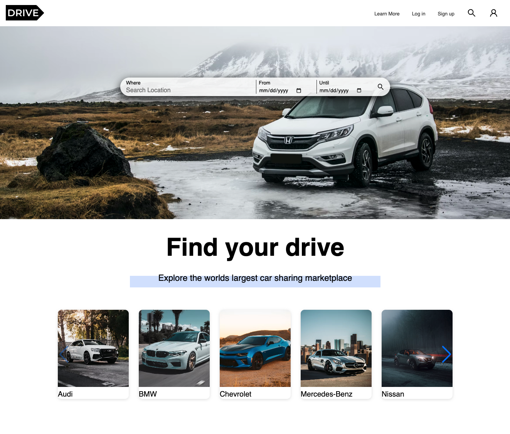

# React Movile Responsive Website

<!-- TABLE OF CONTENTS -->

  
Table of Contents

- [About The Project](#about-the-project)
- [Features](#features)
- [Demo](#demo)
- [Built With](#built-with)
- [Screenshots](#screenshots)

## About The Project

A full mobile responsive website

## Features

- Slider
- Css Modules

## Demo

- Live Page: https://aoz-mern-todo.herokuapp.com/
- Github Repo: https://github.com/alvaroormeno/mern-to-do-app

## Built With

- [HTML](https://developer.mozilla.org/en-US/docs/Web/HTML)
- [CSS](https://developer.mozilla.org/en-US/docs/Web/CSS)
- [Sass](https://sass-lang.com/)
- [JavaScript](https://developer.mozilla.org/en-US/docs/Web/JavaScript)
- [React.js](https://reactjs.org/)
- [Swiper](https://swiperjs.com/reac)

## Screenshots

